# Google Docs Presence Service
## Table of Contents
- [Problem Statement](#Problem-Statement)
- [Overview of the Stack](#Overview-of-the-Stack)
- [Backend](#Backend)
    * [Models and Databases](#Models-and-Databases)
    * [Authentication](#Authentication)
    * [Authorization](#Authorization)
    * [Routing](#Routing)
    * [Websocket and Channel Layer](#Websocket-and-Channel-Layer)
- [Frontend](#Frontend)
    * [Templates](#Templates)
    * [Javascript](#Javascript)
    * [Stylesheets](#Stylesheets)
    * [Websocket Communication](#Websocket-Communication)
- [Test](#Test)
    * [Unit Tests](#Unit-Tests)
    * [Test Functions](#Test-Functions)
- [Deployment](#Deployment)
    * [Heroku](#Heroku)
    * [Local Server](#Local-Server)
    * [Ngrok](#Ngrok)
- [Known Bugs](#Known-Bugs)
    * [Special characters for document names](#Special-characters-for-document-names)
    * [UI Fixes](#UI-Fixes)
    * [Visit History in Mozilla Browser](#Visit-History-in-Mozilla-Browser)
- [Additional Features](#Additional-Features)
    * [Authorized/Unauthorized Users](#Authorized/Unauthorized-Users)
    * [Viewing/Editing Privileges](#Viewing/Editing-Privileges)
    * [Document Editing](#Document-Editing)
- [Glossary](#Glossary)
    * [Login](#Login)
    * [Registration](#Registration)
    * [Dashboard](#Dashboard)
    * [Room](#Room)
- [References](#References)

## Problem Statement  
A Presence Service that imitates the view activity tracking system of google docs. The implementation currently 
supports the following features:
- **User registration**
- **User authentication**
- **User authorization for each document**
- **User interface that displays online users**
- **User interface that displays last viewed activity of all users**
- **Unit testing**
- New document addition

    
## Overview of the Stack  
The project is implemented purely in Django.
- The backend is built in *django* python which communicates with the database via inbuilt *django ORM*.
- There are two database technologies used- *redis* and *postgresql*.
- The frontend is built in pure *javascript* with *jquery* for event handling.
- The web pages are made in *html* with *python tags* and *css*.
- the browser and server have two modes of communication- *http requests* and *websocket*.

The diagram below gives an overview of how a client communicates with the server:

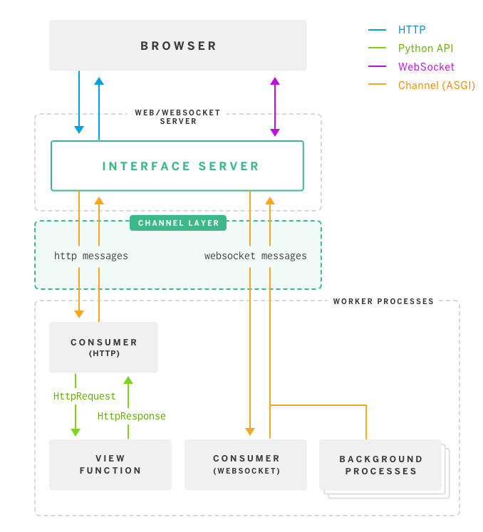

**Explanation:**
- The user communicates with the server through a websocket interface server. 
- The interface distinguishes between http requests and websocket requests and sens them to the view function and 
consumer function respectively. 
- The responses are then returned to the the interface which is further conveyed to the user browser. 
- The communication between the interface and view.consumer functions are done through a channels layer.
    
## Backend  
Explanation of the entire backend implementation
### Models and Databases
The backend uses two database technologies:
- **Postgresql-** Postgresql is the SQL database of choice for basic database implementation. All models implementation 
and ORM communication happens with postgresql via inbuilt django engine.
- **Redis-** Channels for socket communication, due to it's real time asynchronous implementation is best implemented 
via a database that can handle such throughput. Redis which is often used for caching is best suited for this.
- The databases above are used for an easily **scalable system**.

The models used for data management are:
- **User**
    - The implementation uses inbuilt django AUTH_USER_MODEL.
    - It is used to keep track of users for login and registration.
    - it has the following essential columns- `username`, `password`, `email_address`, `last_login`, `date_joined` amongst others.
    - `password` is encrypted using sha-256 algorithm for data protection.
- **Document**
    - This model contains data specific for documents
    - The model currently only contains the `name` column for documents but can be altered to contain more meta data about 
    the document (admin, content, settings, schema) as required for future features.
- **UserDocumentInfo**
    - This model contains relational data between documents and users.
    - The model contains foreign keys to *User* and *Document* tables in the columns `user` and `document`.
    - `last_visited` contains visit history of the user for the document.
    - `authorized` column maintains who all are authorized to view the document.
### Authentication  
- A basic authentication system is used which asks for login before any page is viewed. 
- In case user does not login, a registration system is available.
- Opening any page requires the user to be authenticated. If the user is not authenticated, he is rerouted to the 
login page.
- `@login_required(login_url='login')` decorator is added before every view function for authentication. 
```python
# CODE SNIPPET TO SHOW AUTHENTICATION DECORATOR 

# Docs Dashboard
@login_required(login_url='login')
def dashboard(request):
    if request.method == 'POST':
        document_name = request.POST.get('document')
        . . .
``` 
### Authorization  
- Authorization to view documents is maintained by the `UserDocumentInfo` table.
- Authorization is checked before routing to document room by querying for the `authorized` value in the table for that
user and document.
```python
# CODE SNIPPET TO SHOW AUTHORIZATION

# The function attempts to update last visted value if the user is authorized.
# If the user is not authorized, False is returned.
def update_last_visit_user(user_name, doc_name, authorized):
    user = User.objects.get(username=user_name)
    doc = Document.objects.get(name=doc_name)

    # Return true after update
    try:
        update = UserDocumentInfo.objects.get(user=user, document=doc, authorized=authorized)
        update.last_visited = datetime.now()
        update.save()
        return True

    # Return false for unauthorized users
    except UserDocumentInfo.DoesNotExist:
        return False


# Views.py- room function

# Document Page
@login_required(login_url='login')
def room(request, room_name):
    # Check if document exists
    doc_name = Document.objects.filter(name=room_name)
    if doc_name:
        # Update visited time if user is authorized
        if update_last_visit_user(request.user, room_name, True):
            . . .
        # Reroute to 403 for unauthorized users
        else:
            return defaults.permission_denied(request, '',template_name='403.html')

     else:
        . . .
``` 
### Routing  
- Routing is done in two ways- http routing and websocket routing.
- Http requests are routed via `views.py` which handles the basic pages and their logic.
- Websocket requests are routed to `consumers.py` that handles socket messages (receiving and broadcasting).
- For this purpose a channel layer is made using django channels.
- Since sockets and channels are asynchronous, a normal **wsgi** (web server gateway interface) is not enough. For this 
purpose **asgi** (asynchronous gateway interface) is incorporated.
- Redis ensures the asynchronous communication is **real time** and **scalable**.
### Websocket and Channel Layer  
- The concept of sockets were used in this implementation to maintain an open channel of communication between the user 
and the server.
- The server sends an updated list of **visit history** of all users for the doc to all users whenever a new socket 
connection is made.
```python
# CODE SNIPPET TO SHOW BROADCAST OF VISIT HISTORY

# Obtain updated viewing history
message = self.get_viewing_history()

# Broadcast viewing history
async_to_sync(self.channel_layer.group_send)(
    self.room_group_name,
    {
        'type': 'chat_message',
        'message': message,
        'message_type': 'viewing_history'
    }
)
``` 
- The server also **broadcasts** any message it receives from connected sockets to all users.
```python
# CODE SNIPPET TO SHOW BROADCAST RECEIVED MESSAGES

# Receive message from WebSocket
def receive(self, text_data):
    text_data_json = json.loads(text_data)
    message = text_data_json

    # Send message to room group
    async_to_sync(self.channel_layer.group_send)(
        self.room_group_name,
        {
            'type': 'chat_message',
            'message': message,
            'message_type': 'ping'
        }
    )
``` 
- the `get_viewing_history` function obtains visit history of all users that have ever visited the document
```python
# CODE SNIPPET FOR OBTAINING VISIT HISTORY

# Obtain viewing history for document
def get_viewing_history(self):
    document = Document.objects.get(name=self.room_name)
    viewing_history = UserDocumentInfo.objects.filter(document=document)
    view_history_data = {}

    for i in viewing_history:
        if i.last_visited:
            view_history_data[i.user.username] = i.last_visited.strftime('%Y-%m-%d %H:%M')

    return view_history_data
``` 
- The channel layer is configured to use redis in `settings.py`
```python
# CODE SNIPPET FOR CHANNEL LAYER CONFIGURATION

CHANNEL_LAYERS = {
    'default': {
        'BACKEND': 'channels_redis.core.RedisChannelLayer',
        'CONFIG': {
            "hosts": [('127.0.0.1', 6379)],
        },
    },
}
```
    
## Frontend  
Frontend for the entire project is implemented entirely using **javascript**, **html**, **css** and **bootstrap**.
### Templates
- html pages are stored in `templates/docs` folder, which can then be rendered by views.
```python
# CODE SNIPPET TO SHOW RENDERING OF HTML FILES
render(request, 'docs/<name of file>')
```
### Javascript
- javascript files for all html are stored in `static/docs/js` folder, which can then be imported directly by 
html views.
```html
CODE SNIPPET TO SHOW RENDERING OF HTML FILES




. . .

<script src="">
```

### Stylesheets 
- stylesheet files for all html are stored in `static/docs/css` folder, which can then be imported directly by 
html views.
```html
CODE SNIPPET TO SHOW RENDERING OF HTML FILES




<link rel="stylesheet" type="text/css" href="">
. . .
``` 
### Websocket Communication  
- websocket communication on the browser side is implemented using jquery. 
- `new WebSocket` helps create a socket connection with the channels layer in server
- `chatSocket.onmessage` receives message from server and updates the following info
    - visit history list
    - user list for new online user
- `chatSocket.onclose` prints an error message to console when a socket connection disconnects.
- `showUserDetails` function shows details of user when hovering over the user avatar.
- `hideUserDetails` function hides details of user when not hovering over the user avatar.
- `createCustomUserDetailDiv` function creates the div that contains user information.
- `toggleShowViewedHistory` function toggles between showing visit history and hiding it.
- `pingSocket` function sends a message of type 'ping' to server containing user meta data (avatar, username and 
current timestamp).
- the pinging ensures every user knows who all are connected to the websocket server.
- `removeIdle` function checks online user list with their latest timestamp and removes any user that has been inactive 
more than the threshold.
- `random_rgba` generates random colour for the avatar of the user
    
## Test  
### Unit Tests  
- Unit tests are written in `docs/tests.py`
- Unit tests cover the basic functionality where in correct response is received for every scenario.
- Scenarios for which unit tests are written are:
    - logging in
    - accessing a non existent document
    - authorized and unauthorized access to document
### Test Functions
- The following test functions are written in `docs/tests.py`:
    - `setUpTestData` sets up a basic client with initial information for testing.
    - `test_login` tests login for a user that exists.
    - `test_when_document_does_not_exist` tests when a user is trying to view a non existent document. A 404 error 
    should be generated.
    - `test_user_authorization_to_access_document` tests authorized and unauthorized access to documents.
        - Authorized: a document should appear in the url.
        - Unauthorized: 403 error should be displayed.
    
## Deployment  
Given are the steps for deploying the site for testing/production.
### Heroku  
Essential steps for deploying this project on Heroku:
- `Procfile` tells heroku what to use when deploying the system.
    - `gunicorn` is usually used for deploying web services for django; this does not support channels.
    - In this project, due to the implementation for channels, we have used `daphne` instead.
        - `web: daphne docsAssignment.asgi:application --port $PORT --bind 0.0.0.0 -v2`
        - `worker: python manage.py runworker -v2`
- Since we have used `Postgresql` and `Redis`, we need to get those additions:
    - `heroku addons:create heroku-postgresql`
    - `heroku addons:create heroku-redis`
- Deployment on Heroku can be continued normally: [https://devcenter.heroku.com/articles/getting-started-with-python](https://devcenter.heroku.com/articles/getting-started-with-python)

### Local Server
Essential steps for deploying this project on Heroku:
- Create a virtual environment and activate it.
- Install redis and psotgresql.
- Install the `requirements.txt` file.
- Run `python manage.py runserver`
- Run redis
### Ngrok  
Steps to deploying the project via Ngrok (expose localhost port for online testing):
- Deploy the project in local server.
- Install `ngrok`
- Expose port `8000` (or the post on which project is deployed locally).
- Run `./ngrok <port number>`
    
## Known Bugs  
### Special characters for document names
- The view for documents with special character (unicode) renders correctly.
- The websocket connection fails; the url is not getting parsed correctly.
- Solution 1: fix code so that it can support unicode special characters.
- Solution 2: (quick fix) disable all special characters through url validation.

### UI Fixes
- Proper components for UI elements like the online list and list of visit activities.
- Implementation of the frontend in a more robust framework such as ReactJS or TypeScript.
- Fixes on general UI/UX of the web page.

### Visit History in Mozilla Browser
- In a Mozilla browser, visit history is rendered incorrectly.
- The image below shows the UI bug.

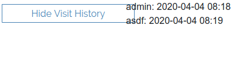
    
## Additional Features  
Addition Features that can be added
### Authorized/Unauthorized Users  
- This feature would allow users to handle authorizations for registered users.
- The document admin should be able to check/uncheck visiting privileges of each user.
### Viewing/Editing Privileges
- The document admin can give or edit viewing and editing privileges of registered user.
### Document Editing
- The project can easily handle real time editing of the document.
- **Socket** implementation allows users to communicate the **state** of their document continuously and efficiently.
- The channels server will require a system that maintains integrity of the document amongst all other
connected users.
## Glossary
UI screenshots of various pages and scenarios
### Login
Login Page

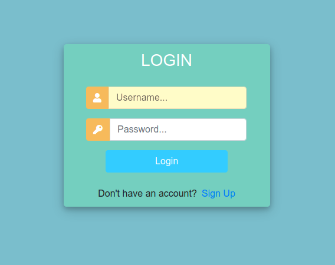
#### Failed Login
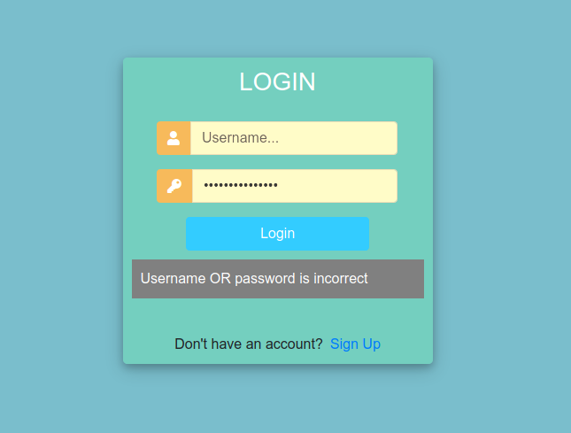
### Registration
Registration Page

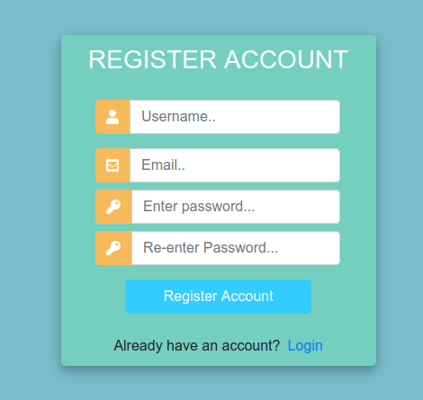
#### Successful Registration
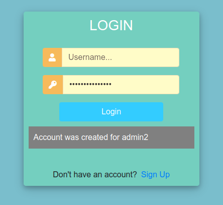
#### Existing User
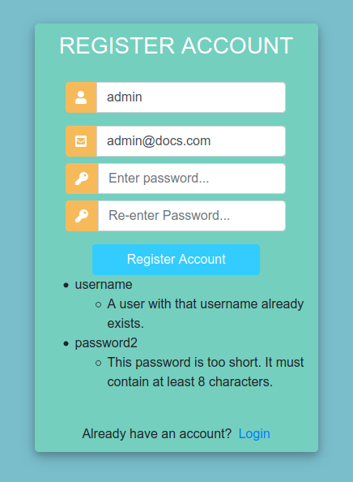
### Dashboard
Dashboard Page

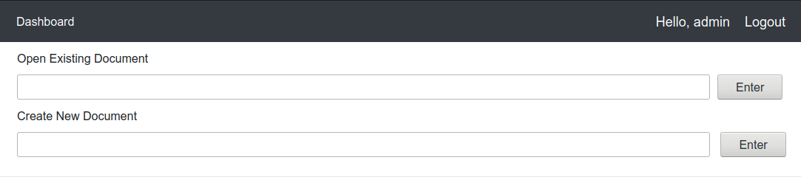
#### Successful Document Creation
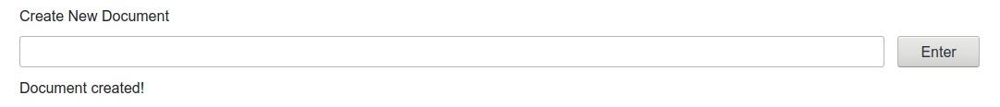
#### Existing Document
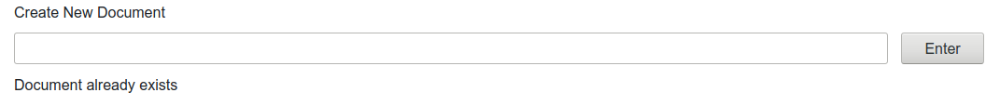
#### Unauthorized Access
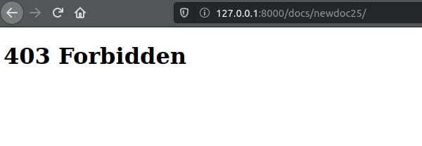
### Room
Room Page

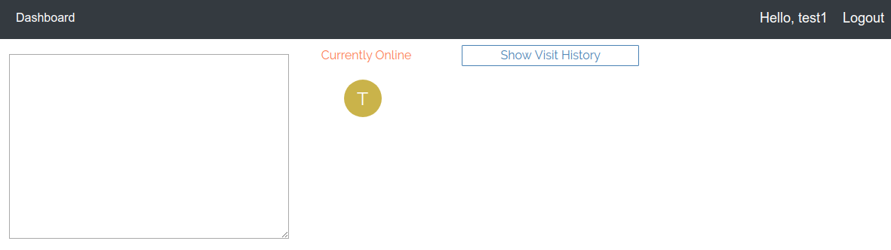
#### Online Users
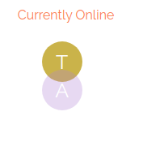
#### Visit History
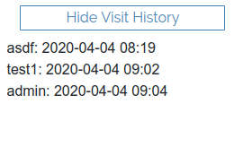
#### Hover Feature
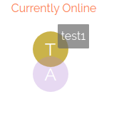
## References
1. [Django Documentation](https://docs.djangoproject.com/en/3.0/)
2. [Channels 2 Documentation](https://channels.readthedocs.io/en/latest/)
3. [Deploy on Heroku](https://devcenter.heroku.com/articles/getting-started-with-python)
4. [Deploy Channels application on Heroku](https://blog.heroku.com/in_deep_with_django_channels_the_future_of_real_time_apps_in_django)
